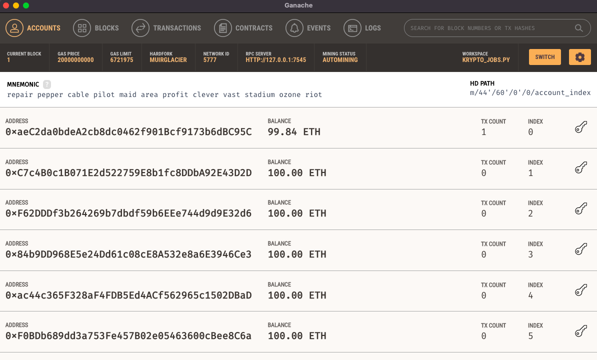
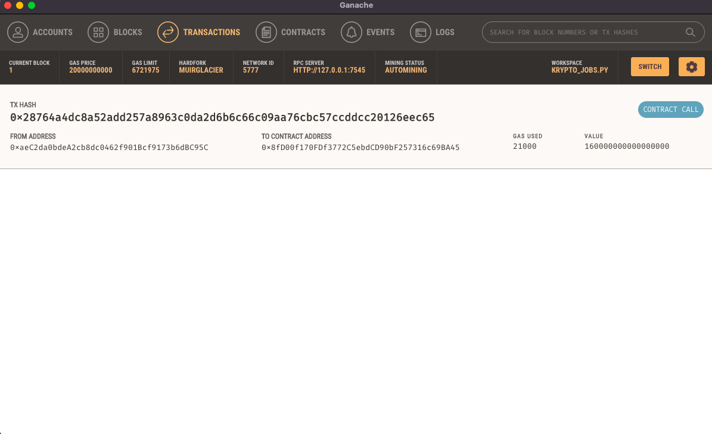

# Module-19-Challenge
## Cryptocurrency Wallet (KryptoJobs2Go)

---

 

### <u>Overview of the Analysis</u>

 

### <b>Purpose:</b>

The purpose of this program is to develop an app called KryptoJobs2Go in which customers are able to locate & hire fintech professionals for consulting work. The application is integrated to the Ethereum blockchain network in order to pay fintech professionals via cryptocurrency. 

### <b>Process & Variables:</b>

Within the main project folder are two Python files (krypto_jobs.py & crypto_wallet.py). The krypto_jobs.py file contains UI code and takes advantage of the Streamlit library for deployment. The crypto_wallet.py file contains all the backend Ethereum transaction functions. The krypto_jobs.py file essentially integrates the functions & methods from the crypto_wallet.py file in order to process the required transactions. The two files automate the tasks associated with digital wallets, accessing Ethereum account balances, as well as signing and sending transactions. It utilizes the Ganache test-net to help accomplish this.

The high level overview of the entire program build process is as follows:
 
i.) Generate a new Ethereum account instance by using the mnemonic seed phrase provided by Ganache.
 
ii.) Retrieve & display the account balance associated with your Ethereum account address.
 
iii.) Calculate the total value of an Ethereum transaction that pays a KryptoJobs2Go candidate for their work.
 
iv.) Digitally sign a transaction that pays a KryptoJobs2Go candidate, and send this transaction to the Ganache blockchain.
 
v.) Review the transaction hash code associated with the validated blockchain transaction.
 

---
#### <b><u>Step 1: Import Ethereum Transaction Functions Into the KryptoJobs2Go Application</b></u>
 
The first part of the development process required importing functions from the crypto_wallet.py file into the krypto_jobs.py UI app file.
 
 
i.) Firstly, the mnemonic seed phrase generated via Ganache is saved as a unique workspace called 'KRYPTO_JOBS.PY' in order to retain the 128-bit (12-word) seed phrase. This string phrase is then saved as a variable MNEMONIC in the .env project file.
 
ii.) In the krypto_jobs.py file, imported from the crypto_wallet.py file, the following functions are subsequently called: 
 
&emsp; a.) 'generate account'
 
&emsp; b.) 'get_balance'
 
&emsp; c.) 'send_transaction'
 
iii.) In the Streamlit sidebar (st.sidebar) section of code a variable called 'account' is instantiated and set to the above imported 'generate_account' function (which creates the customer's HD wallet & Ethereum account).
 
iv.) In the same section of the krypto_jobs.py file, a new 'st.sidebar.write' function is created that displays the balance of the customer's account. Here, the 'get_balance' function is called and passed in as its parameter is the function 'account.address'. 
 

---
#### <u><b>Step 2: Calculate Fintech Pro Candidate's Wage</b></u>
 
The next section involves forming code that determines the fintech professional's wage. This is a function of the consultant's hourly rate and the total number of hours they worked for the customer. Note: the hourly rate is located within the 'candidate_database' dictionary. Following this, code is created that calculates the wage value to send in a transaction to pay the fintech consultant. This transaction is ultimately authorized with their unique digital signature. 
 
 
i.) The customer selects a fintech professional they wish to hire from the dropdown menu & input the required number of hours they wish to contract them for. The application is coded, such that, it will automatically calculate the amount the worker will be paid in ETH.
 
&emsp;The formula for this is: 
 
&emsp;wage = candidate_database[person][wage] * hours
 
ii.) This 'wage' variable is then deployed into the Streamlit sidebar using the standard st.sidebar.write function.
 

---
#### <u><b>Step 3: Sign and Execute a Payment Transaction</b></u>
  
The next sub-routines illustrate how the customer is able to then send the ETH transaction that pays the above fintech candidate's wage. 
 
i.) Within the 'if st.sidebar.button("Send Transaction"), logic is added that allows the 'send_transaction' function to work correctly.
 
ii.) Firstly, the 'send_transaction' function is called and three parameters (w3, account, candidate_address, wage) are passed into the encapsulated parameter parenthesis in order to return the transaction_hash.
 
As can be seen from above, the 'send_transaction' function is set to a variable 'transaction_hash', which is then written to the Streamlit sidebar display.
 

---
#### <u><b>Step 4: Inspect the Transaction</b></u>
 
Next, the krypto_jobs.py 'KryptoJobs2Go' app is finalized in order to trial & inspect. A test transaction is initiated and verified via Ganache to make sure the program functions as intended.

 
i.) From terminal, change directory to the main project folder where the krypto_jobs.py file resides. (Note: Activate the necessary dev in the terminal window, as required). 
 
ii.) Launch the Streamlit app by running the command 'streamlit run krypto_jobs.py'. 
 
iii.) After the webpage successfully loads, select a candidate from the people dropdown box on the left-hand sidebar. 
 
iv.) Enter the number of hours required to contract said fintech pro for.
 
v.) Press the 'Send Transaction' button which ultimately signs & sends the transaction with the customer's Ethereum account info.
 
vi.) Bring up the Ganache app & the applicable 'KRYPTO_JOBS.PY' workspace associated with the 128-bit (12 word seed phrase) for the Ethereum customer account. 
 
vii.) Verify that the address in index 0 associated with the customer account matches the 'Client Account Address' at the top left-hand section of the KryptoJobs2Go Streamlit app and that the applicable number of ETH has been deducted from the account from the just completed transaction.
 
viii.) Further verify the transaction has taken place by navigating to the 'Transactions' tab on the Ganache GUI homepage of said client account (Note the TX Hash). Verify the 'From Address' & 'To Contract Address' match the customer & fintech professional's individual ETH HD wallet addresses, respectively.
 
 

### <u>Results</u>

- <u> KryptoJobs2Go Streamlit Interface </u>

  

  
  

  The figure above illustrates the resulting KryptoJobs2Go Streamlit GUI interface with all 'Client Account Address and Ethernet Balance in Ether', 'Select Person/Number of Hours', 'Candidate Name, Hourly Rate, and Ethereum Address', 'Total Wage in Ether', & 'Validated Transaction Hash' info displayed on the left-hand sidebar & fintech professional profile info the center portion of the webpage.

   
   

- <u> Ganache Account Details </u>

  

  
  

  The figure above illustrates the account balance details for the customer's applicable 128-bit (12 word seed-phrase) account details.

   
   

- <u> Ganache Transaction Details </u>

  

  
  

  Above is the Ganache screenshot displaying the details of the test transaction between the customer & client Ethereum HD wallet addresses. Also indicated is the amount of gas consumed for the transaction as well as the transaction amount in Wei.

   
   

### <u>Summary</u>

In summary, the KryptoJobs2Go application functions as intended: A means to search for fintech professional consultants based on their individual assessment rating/hourly rate, hire them for a specified number of hours and ultimately pay them a specified wage for their services by transforming ETH funds between the customer & fintech professional client's unique ETH wallet addresses. 
